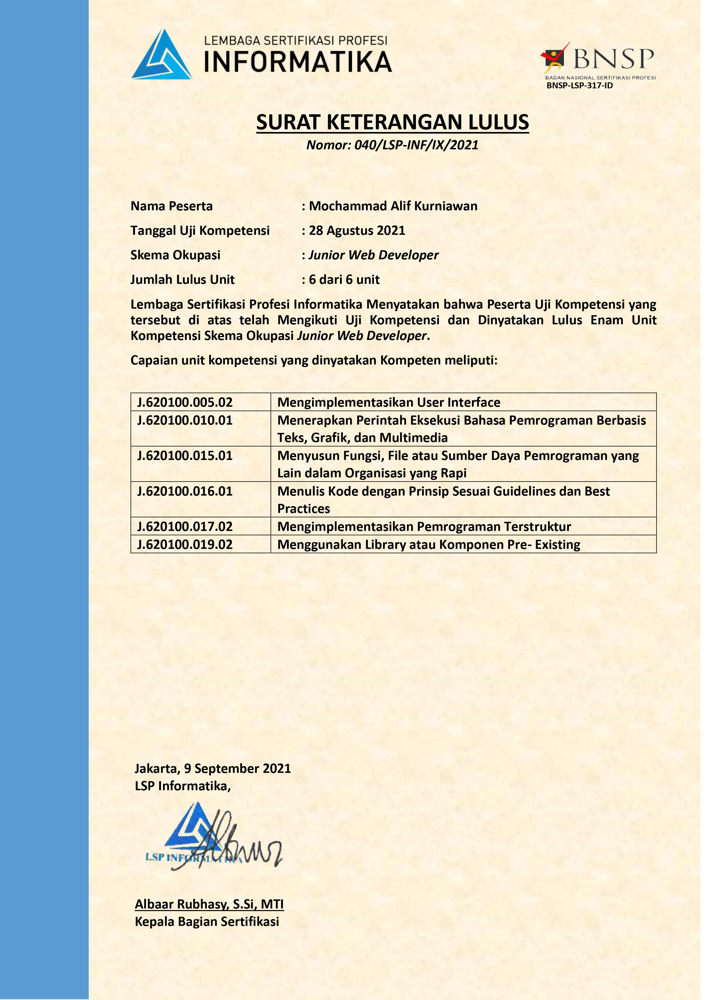

# README!
Aplikasi tersebut dibuat sebagai salah satu syarat kelulusan pelatihan BNSP tahun 2021 pada bidang **Junior Web Developer**. Aplikasi tersebut menyediakan fungsi untuk melakukan pendaftaran siswa baru dengan studi kasus penerimaan siswa baru pada **SMK NEGERI 35 JAKARTA**. Halaman yang terdapat pada aplikasi tersebut hanya berisikan halaman admin sebagai administrator dan user sebagai siswa pendaftar.

Aplikasi dibuat menggunakan `PHP Native` pada sisi server dan sisi client untuk mempercantik tampilan didukung oleh `Bootstrap 5` sebagai template serta sedikit tambahan JavaScript untuk melakukan validasi form inputan. Library PHP `MPdf` yang memungkinkan admin/user melakukan export file dengan format PDF. Serta untuk proses upload file, script dibuat dengan `PHP Native` tanpa menggunakan library pihak ketiga. Aplikasi didukung layanan `Live Chat` menggunakan API dari `tawk.to` yang dikhususkan bagi pendaftar atau siswa baru berinteraksi dengan admin untuk aktivasi akun.

## Instalasi
```zsh
cd app/
composer install
composer dump-autoload
composer require mpdf/mpdf
```

## Menu Aplikasi

#### Admin
1. Informasi Pendaftaran
2. Detail Data Calon Siswa
3. Informasi Users

Login Admin: `admin@gmail.com` - `rasmuslerdorf`

#### User
1. Registrasi Akun
2. Pendaftaran Siswa Baru
3. Lihat Status Pendaftaran


## Certified
